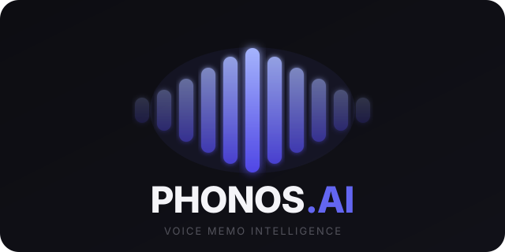

<div align="center">



**Your voice memos, intelligently structured.**

Record on your iPhone. Walk into the office. Your meeting notes are already waiting — transcribed, summarised, and formatted for how you actually work.

[](https://python.org)
[](https://flask.palletsprojects.com)
[](https://console.groq.com)
[](https://openrouter.ai)
[](LICENSE)

**🌐 Live demo:** [phonos-production.up.railway.app](https://phonos-production.up.railway.app/)

</div>

---

## The problem

Most professionals in knowledge-heavy roles — finance, consulting, legal, sales — record voice memos constantly. But audio files are hard to search, reference, or share. Turning a recording into structured, actionable notes takes 30–60 minutes per meeting by hand, and key details get lost in the process.

## What Phonos.ai does

Phonos.ai is a personal voice memo intelligence tool. Record on your iPhone, it appears on your desktop, and within minutes you have a structured meeting document — automatically transcribed, summarised, and ready for your committee pack or inbox. Zero clicks after setup.

---

## Screenshots

| Sidebar & memo list | Meeting notes detail |
|---|---|
|  |  |

> **Note:** Add your own screenshots by saving them to `assets/` and updating the paths above.

---

## Core use cases

**Investment / allocator due diligence** — Drop a voice memo from an LP meeting and get a fully structured allocator note: investment philosophy, team, AUM, track record, portfolio construction, terms — extracted in the exact format your IC requires. The AI learns your firm's shorthand and terminology with every memo, getting sharper over time.

**Sales and client meetings** — Record a client call, get an instant summary with action items and next steps. Reps save 45 minutes per meeting and never forget a commitment again.

**Internal knowledge capture** — Strategy discussions, brainstorming sessions, post-mortems. Everything becomes searchable, comparable, and shareable. Ask the AI questions across all your notes in a single chat interface.

**Recurring meeting intelligence** — Link meetings into a Series. The comparison tool automatically surfaces what changed between the Q1 and Q2 LP call — new risks, revised outlooks, whether commitments were followed through on.

**iCloud-native for iPhone users** — Record on your phone, walk into the office, and the transcript and notes are already waiting. No app switching, no uploading.

## Why it's different

Most transcription tools stop at the transcript. Phonos.ai applies domain-specific intelligence on top — industry glossaries, structured formatting, custom prompt types per meeting category — so the output is ready to use, not ready to edit.

**Privacy-first by design.** The app runs on your own machine (or your own private server). Your audio, transcripts, and notes are stored locally in a SQLite database that never leaves your computer. The only external calls are to Groq (transcription) and OpenRouter (note generation) — the same way any AI writing tool works. You control your data.

---

## What you need before starting

- A Mac (the setup below is for macOS)
- Python 3.10 or newer — check with `python3 --version` in Terminal
- Two free API keys (takes about 5 minutes to get both):
  - **Groq** — for transcription (free): https://console.groq.com
  - **OpenRouter** — for note generation (free tier available): https://openrouter.ai

---

## First-time setup

Open Terminal and run these commands one by one:

```bash
# 1. Go into the project folder
cd ~/Code/phonos

# 2. Copy the example config file
cp .env.example .env

# 3. Open it and paste in your API keys
nano .env
```

Inside `.env`, fill in your keys — it looks like this:

```
GROQ_API_KEY=gsk_...your key here...
OPENROUTER_API_KEY=sk-or-...your key here...
```

Press `Ctrl+O` then `Enter` to save, then `Ctrl+X` to exit.

```bash
# 4. Install dependencies (only needed once)
pip3 install -r requirements.txt

# 5. Start the app
bash start.sh
```

Then open your browser and go to: **http://localhost:5001**

---

## Every day after that

Just run this from the project folder:

```bash
bash start.sh
```

## Run automatically on startup (optional)

If you want Phonos running whenever your Mac is on — without having to start it manually — set it up as a background service:

```bash
cat > ~/Library/LaunchAgents/com.phonos.app.plist << 'EOF'
<?xml version="1.0" encoding="UTF-8"?>
<!DOCTYPE plist PUBLIC "-//Apple//DTD PLIST 1.0//EN" "http://www.apple.com/DTDs/PropertyList-1.0.dtd">
<plist version="1.0">
<dict>
  <key>Label</key>
  <string>com.phonos.app</string>
  <key>ProgramArguments</key>
  <array>
    <string>/bin/bash</string>
    <string>/Users/hw/Code/phonos/start.sh</string>
  </array>
  <key>WorkingDirectory</key>
  <string>/Users/hw/Code/phonos</string>
  <key>RunAtLoad</key>
  <true/>
  <key>KeepAlive</key>
  <true/>
  <key>StandardOutPath</key>
  <string>/Users/hw/Code/phonos/phonos.log</string>
  <key>StandardErrorPath</key>
  <string>/Users/hw/Code/phonos/phonos.log</string>
</dict>
</plist>
EOF

launchctl load ~/Library/LaunchAgents/com.phonos.app.plist
```

**http://localhost:5001** will be available whenever your Mac is logged in — no manual start needed.

Other commands:

```bash
launchctl stop com.phonos.app                                      # stop it
launchctl start com.phonos.app                                     # start it
launchctl unload ~/Library/LaunchAgents/com.phonos.app.plist       # remove it entirely
tail -f ~/Code/phonos/phonos.log                                   # view logs
```

---

## How to use it

### Recording on your iPhone and uploading

1. Record in the **Voice Memos** app on your iPhone
2. Tap the recording → tap `···` → **Share** → **Save to Files** → pick a folder
3. Open Phonos in your browser → click **+ Upload Voice Memo** → select the file
4. It automatically starts transcribing and generating notes — no extra clicks needed

You can select multiple recordings at once and they'll all be processed in order.

### Choosing a note style

- **Standard** — general meeting notes with summary, action items, decisions, next steps
- **Hedge Fund** — structured allocator meeting note with sections for investment philosophy, team, AUM, portfolio construction, risk management, outlook, terms, and track record. Understands finance shorthand out of the box, and learns new terminology from each meeting you process (see "Dynamic Glossary" below)

### Auto-generated titles

Every memo automatically gets a short title extracted from the AI-generated notes — so you see "Q1 Allocator Review" in the sidebar instead of "20260329 230125-6587917D". You can also rename any memo manually by clicking the pencil icon.

### Chat with your notes

Switch to the **Chat with Notes** tab and ask anything across all your recordings — "What did the fund say about their drawdown?" or "What action items came out of last week's meetings?" Powered by DeepSeek V3. History persists across restarts.

### Recurring meeting series

If you meet with the same fund or person regularly, link those memos together using **📅 Link to recurring meeting series**. Then hit **⚡ Compare meetings** to get an AI-generated "What Changed?" brief across all sessions.

### Playback

Click the **Transcript** tab on any memo to see the audio player and timestamped transcript. Click any timestamp to jump to that moment in the recording.

---

## Dynamic Glossary (Hedge Fund mode)

Every time you process a Hedge Fund memo, Phonos runs a second AI pass in the background to scan the transcript for new terminology — fund names, strategy names, proprietary signals, internal shorthand — anything not already in the standard glossary.

New terms are saved to a private database on your computer. From that point on, every future Hedge Fund memo is processed with that growing vocabulary injected into the prompt, so the AI understands your specific managers, strategies, and in-house language.

You never have to configure it. It builds itself as you use the app.

**Example:** If a manager refers to their "STAR signal" in a meeting, Phonos learns what that term means in context and applies it correctly in every future note for that manager.

---

## Editing the Hedge Fund prompt

The note format and rules for each note type live as plain text files in the `prompts/` folder:

```
prompts/
├── standard.txt      ← general meeting notes format
├── hedge_fund.txt    ← allocator-style meeting minutes
├── diff.txt          ← "What Changed?" comparison prompt
└── glossary_extract.txt  ← (internal) term extraction prompt
```

Open any of these in TextEdit or any text editor, make your changes, and save. The change takes effect the next time you process a memo — no code changes, no restart needed.

---

## iCloud auto-watch (optional)

If you have Voice Memos syncing to iCloud, Phonos can detect new recordings automatically and process them without any uploading.

To enable it, turn on iCloud sync on your iPhone:
**Settings → your name → iCloud → Voice Memos → toggle on**

Once synced, new recordings will appear in:
`~/Library/Group Containers/group.com.apple.VoiceMemos.shared/Recordings/`

Phonos watches this folder automatically when the app is running. The sidebar shows a green **"watching"** pill when it's active — hover over it to see which folder is being watched. New memos are picked up every 20 seconds, transcribed, and appear in the sidebar without you doing anything.

---

## Saving notes to Apple Notes (macOS only)

When generating notes, toggle on **Add to Apple Notes**. Phonos creates two linked notes:
- **Voice Notes** folder — the structured meeting summary
- **Voice Transcripts** folder — the full transcript

Both notes link to each other so you can jump between them.

---

## Troubleshooting

**"File not found in voice_memos folder"**
The uploaded file didn't save. Try uploading again.

**Transcription is slow**
Normal for long recordings — Groq compresses the audio first if it's large. A 1-hour recording takes around 30–60 seconds.

**"not watching" shown in sidebar**
Either the app was just started for the first time (restart it), or iCloud Voice Memos sync isn't enabled on your iPhone yet.

**iPhone recordings not showing up via iCloud watch**
Make sure iCloud Voice Memos sync is on (Settings → iCloud → Voice Memos). There can be a delay of a minute or two between recording on your phone and the file appearing on your Mac. Phonos checks every 20 seconds.

**Apple Notes toggle is missing**
Apple Notes integration only works on macOS. It won't appear on Windows or Linux.

**App won't start / "port already in use"**
The app runs on port 5001. If something else is using that port, open `.env` and add `PORT=5002` (or any other number), then restart.

---

## File structure (for the curious)

```
phonos/
├── assets/                ← logo and screenshots
├── voice_memos/           ← your audio files live here
├── memos.db               ← all transcripts, notes, and glossary stored here (SQLite)
├── .env                   ← your API keys (never share this file)
├── start.sh               ← the script you run to start the app
├── run.py                 ← app entry point
├── transcriber.py         ← Groq Whisper transcription
├── summarizer.py          ← DeepSeek note generation
├── glossary.py            ← dynamic terminology extraction and injection
├── oauth_client.py        ← Google OAuth setup
├── prompts/               ← all AI prompt templates as plain text files
│   ├── standard.txt
│   ├── hedge_fund.txt
│   ├── diff.txt
│   └── glossary_extract.txt
├── prompts.py             ← loads prompts from the prompts/ folder
├── chat.py                ← Chat with Notes logic
├── apple_notes.py         ← Apple Notes integration (macOS only)
├── watcher.py             ← iCloud folder auto-watch
├── db.py                  ← database layer
└── routes.py              ← all API endpoints
```

---

## Deploying online

See `DEPLOY.md` for step-by-step instructions to deploy on Railway (free tier available). Once deployed, you get a public URL you can open on any device — phone, tablet, or another laptop. Supports Google OAuth for multi-user access with fully isolated accounts.
